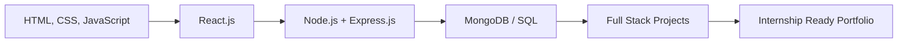

<div align="center">


<br />

<a href="mailto:wadhwagungun09@gmail.com">
  
</a>
<a href="https://github.com/GungunW-0903">
  
</a>


</div>

---

## Profile

I am a **Computer Science student** , passionate about building useful, clean and responsive web applications. I enjoy working across frontend development, problem solving and project-based learning.

My focus is to write structured code, design simple user experiences and keep improving through real projects.

```js
const gungun = {
  education: "B.Tech, National Institute of Technology Patna",
  currentFocus: ["Web Development", "Data Structures", "Algorithms"],
  interests: ["Frontend Engineering", "Databases", "Problem Solving"],
  strengths: ["Teamwork", "Time Management", "Communication", "Leadership"],
  goal: "Build practical products and grow as a software engineer"
};
```

---

## The Arsenal

<div align="center">


</div>

---

## Education


---

## Featured Work

<table>
  <tr>
    <td width="50%">
      <h3>Airbnb-inspired Booking Platform</h3>
      <p>
        Designed and engineered an Airbnb-like rental marketplace from scratch with dynamic listings,
        search, filtering and reservation flows.
      </p>
      <p>
        <b>Built with:</b> React.js, MongoDB, Node.js, Express.js
      </p>
      <a href="https://github.com/GungunW-0903/Airbnb_project">
        
      </a>
    </td>
    <td width="50%">
      <h3>Movie Ticket Booking App - QuickShow</h3>
      <p>
        Developing a responsive movie ticket booking web app where users can search movies,
        view showtimes, book tickets and select seats in real time.
      </p>
      <p>
        <b>Focus:</b> Responsive UI, booking flow, user experience
      </p>
      
    </td>
  </tr>
</table>

---

## GitHub Insights

<div align="center">


</div>

---

## What I Bring

<div align="center">

| Skill Area | What I Am Building |
| --- | --- |
| Frontend Development | Clean, responsive and user-friendly interfaces |
| Programming | Stronger logic through Java, C++, Python and DSA |
| Databases | Practical understanding of SQL and MongoDB |
| Collaboration | Teamwork, communication and consistent execution |

</div>

---

## Current Learning Roadmap

<div align="center">



</div>

---

<div align="center">


<b>Thanks for visiting my profile.</b>
<br />
<i>Building, learning and improving one project at a time.</i>

</div>
